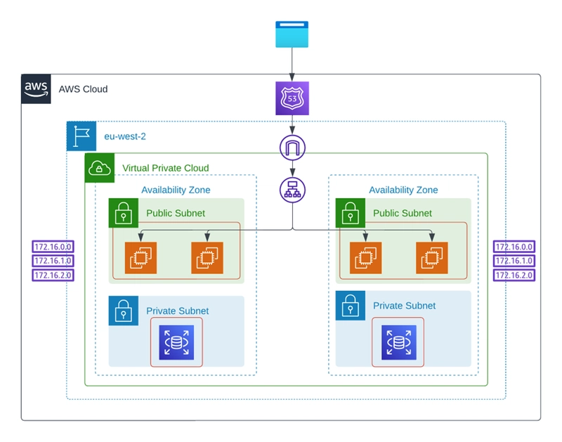

# End To End Automated DevOps Pipeline For Clinic Appointment System

A project under the supervision of **Digital Egypt Pioneers Initiative**.
This project aims to build a fully automated DevOps pipeline for deploying, managing, and monitoring a **Clinic Appointment System** using modern DevOps tools and cloud technologies.

---

---

## 👥 Team Members
- Eslam Hany Farouk Mohamed **(Team Leader)**
- Abdallah Wael Saeid Elshahaly
- Moataz Kamal Mohamed Hassan
- Yahya Mostafa Yahya Emam
- Mariam Sayed Nabil Ali

---

## 📌 Project Overview
- The project aims to build a**reliable, scalable, and fully automated CI/CD pipeline** for deploying a **Clinic Appointment System**.
- The system will be deployed on **AWS Cloud** using **Terraform**, containerized using **Docker**, orchestrated using **Kubernetes**, and configured using **Ansible**.
- Monitoring and alerting will be implemented using **Prometheus**, while the entire pipeline will be automated using **GitHub Actions** and custom **Bash scripts**. 

---

## 🎯 Project Objectives
- Automating the entire build → deploy → monitor workflow with minimal manual work.
- Deploying the Clinic Appointment System on AWS using Infrastructure as Code (Terraform).
- Containerizing all application components using Docker.
- Managing and orchestrating containers using Kubernetes clusters.
- Implementing configuration management using Ansible.
- Enabling continuous integration and continuous delivery using GitHub Actions.
- Providing real-time monitoring, metrics collection, and alerting using Prometheus.
- Ensuring scalability, reliability, and fault tolerance for the application.
---

## 📂 Project Scope
- **Infrastructure as Code**: Provisioning EC2 instances, VPC, networking, and Kubernetes clusters using Terraform.
- **Configuration Management**: Using Ansible to install Docker, configure Kubernetes (kubeadm), and prepare nodes.
- **Containerization**: Package the Clinic Appointment System into Docker images and store them in a container registry.
- **Orchestration**: Deploy and manage application workloads on a Kubernetes cluster.
- **Automation**: Build a complete CI/CD pipeline using GitHub Actions.
- **Monitoring**: Deploy Prometheus to collect system and application performance metrics.
- **Scripting**: Use Bash scripts for automation tasks and pipeline triggers.
- **Scalability**: Ensure the system can handle high traffic and large numbers of appointment requests efficiently.  

---
## AWS architecture

---

## 🗓 Team Roles & Responsibilities
https://drive.google.com/file/d/16rANMd0RgUsfxwhpBTdMsY7YFNoqbibc/view?usp=sharing
---
