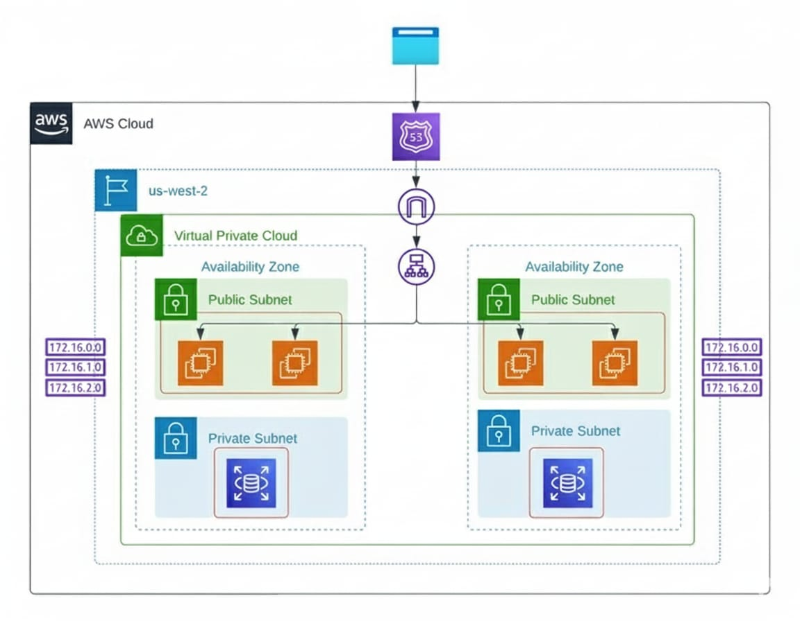

# End To End Automated DevOps Pipeline For Clinic Appointment System

A project under the supervision of **Digital Egypt Pioneers Initiative**.
This project aims to build a fully automated DevOps pipeline for deploying, managing, and monitoring a **Clinic Appointment System** using modern DevOps tools and cloud technologies.

---


---

## 👥 Team Members
- Eslam Hany Farouk Mohamed **(Team Leader)**
- Abdallah Wael Saeid Elshahaly
- Moataz Kamal Mohamed Hassan
- Yahya Mostafa Yahya Emam
- Mariam Sayed Nabil Ali

## 🗓 Team Roles & Responsibilities
https://drive.google.com/file/d/19IGdDwkpUju2mAEF3QMG9_NSNMJXQR9_/view?usp=sharing


---

## 📌 Project Overview
- The project aims to build a**reliable, scalable, and fully automated CI/CD pipeline** for deploying a **Clinic Appointment System**.
- The system will be deployed on **AWS Cloud** using **Terraform**, containerized using **Docker**, orchestrated using **Kubernetes**, and configured using **Ansible**.
- Monitoring and alerting will be implemented using **Prometheus**, while the entire pipeline will be automated using **GitHub Actions** and custom **Bash scripts**. 

---

## 🎯 Project Objectives
- Automating the entire build → deploy → monitor workflow with minimal manual work.
- Deploying the Clinic Appointment System on AWS using Infrastructure as Code (Terraform).
- Containerizing all application components using Docker.
- Managing and orchestrating containers using Kubernetes clusters.
- Implementing configuration management using Ansible.
- Enabling continuous integration and continuous delivery using GitHub Actions.
- Providing real-time monitoring, metrics collection, and alerting using Prometheus.
- Ensuring scalability, reliability, and fault tolerance for the application.
---

## 📂 Project Scope
- **Infrastructure as Code**: Provisioning EC2 instances, VPC, networking, and Kubernetes clusters using Terraform.
- **Configuration Management**: Using Ansible to install Docker, configure Kubernetes (kubeadm), and prepare nodes.
- **Containerization**: Package the Clinic Appointment System into Docker images and store them in a container registry.
- **Orchestration**: Deploy and manage application workloads on a Kubernetes cluster.
- **Automation**: Build a complete CI/CD pipeline using GitHub Actions.
- **Monitoring**: Deploy Prometheus to collect system and application performance metrics.
- **Scripting**: Use Bash scripts for automation tasks and pipeline triggers.
- **Scalability**: Ensure the system can handle high traffic and large numbers of appointment requests efficiently.
  
---
## ⚙ AWS architecture

---

## 🧩 Application architecture

```mermaid
 flowchart LR
 subgraph client["External Access"]
        browser["Browser / REST Client"]
  end
 subgraph iac["Infrastructure as Code\n(Terraform on AWS)"]
        terraform["Terraform\nmain.tf, variables.tf, security_groups.tf\nCreates EC2 instances"]
  end
 subgraph aws["AWS EC2 Nodes"]
        mgmt_node["Management / Monitoring Node\n(ansible.sh, management.sh)"]
        master_node["K8s Master Node\n(master.sh)"]
        worker1_node["K8s Worker Node 1\n(worker1.sh)"]
        worker2_node["K8s Worker Node 2\n(worker2.sh)"]
  end
 subgraph cm["Configuration Management\n(Ansible)"]
        inventory["Inventory [DevOps]\n192.168.126.137-139"]
        playbook["Install_Docker.yml\nInstall Docker on all servers"]
  end
 subgraph fe["Frontend Tier"]
        svc_frontend["Service: hospital-frontend-service\nNodePort 30080 → port 80"]
        dep_frontend["Deployment: hospital-frontend-deployment\nPods: React (patients) + Nginx"]
        svc_dashboard["Service: hospital-dashboard-service\nNodePort 30081 → port 80"]
        dep_dashboard["Deployment: hospital-dashboard-deployment\nPods: React (admins) + Nginx"]
  end
 subgraph be["Backend APIs\n(Node.js / Express)"]
        svc_backend["Service: hospital-backend-service\nClusterIP :5000"]
        dep_backend["Deployment: hospital-backend-deployment\nPods: backend API"]
  end
 subgraph mid["K8s Internal Connections"]
        api_user["REST: /api/v1/user/*\nlogin, register, doctors, admins"]
        api_appointment["REST: /api/v1/appointment/*\nbook, list, update, delete"]
        api_message["REST: /api/v1/message/*\nsend & list messages"]
        conn_mongo["DB Conn String\nMONGO_URL / MONGO_URI"]
        metrics_link["Metrics\n/metrics endpoint"]
  end
 subgraph db["Stateful Services"]
        svc_mongo["Service: mongo-service\nClusterIP :27017"]
        dep_mongo["Deployment: mongo-deployment\nMongoDB Pod"]
        vol_mongo["Volume: mongo-storage\n(emptyDir /data/db)"]
  end
 subgraph k8s["Kubernetes Cluster\n(namespace: default)"]
        k8s_api["K8s Control Plane\nAPI server / etcd"]
        fe
        be
        mid
        db
  end
 subgraph mon["Monitoring Stack on Management Node\n(Prometheus & Grafana)"]
        prom["Prometheus\nmanagement.sh\nscrapes /metrics"]
        graf["Grafana\nDashboards"]
        mongoexp["MongoDB Exporter\n(mongodb_exporter)"]
        nodeexp["Node Exporter\n(host metrics)"]
  end
    browser -- HTTP :30080\n(Patient Frontend) --> svc_frontend
    browser -- HTTP :30081\n(Admin Dashboard) --> svc_dashboard
    terraform --> mgmt_node & master_node & worker1_node & worker2_node
    mgmt_node -- SSH + Ansible --> inventory
    inventory --> playbook
    playbook --> master_node & worker1_node & worker2_node
    master_node -- kubeadm init --> k8s_api
    worker1_node -- kubeadm join --> k8s_api
    worker2_node -- kubeadm join --> k8s_api
    svc_frontend --> dep_frontend
    svc_dashboard --> dep_dashboard
    svc_backend --> dep_backend
    dep_frontend -- Axios → /api/v1/user/* --> api_user
    dep_frontend -- Axios → /api/v1/appointment/* --> api_appointment
    dep_frontend -- Axios → /api/v1/message/* --> api_message
    dep_dashboard -- Axios → /api/v1/user/* --> api_user
    dep_dashboard -- Axios → /api/v1/appointment/* --> api_appointment
    dep_dashboard -- Axios → /api/v1/message/* --> api_message
    dep_backend --> api_user & api_appointment & api_message & conn_mongo & metrics_link
    conn_mongo --> svc_mongo
    svc_mongo --> dep_mongo
    dep_mongo --> vol_mongo
    mgmt_node --> mon
    metrics_link --> prom
    mongoexp -- Mongo metrics --> prom
    nodeexp -- Node metrics --> prom
    prom -- Data source --> graf

    style terraform fill:#FFE0B2
    style mgmt_node fill:#FFE0B2
    style master_node fill:#FFE0B2
    style worker1_node fill:#FFE0B2
    style worker2_node fill:#FFE0B2
    style inventory fill:#FFE0B2
    style playbook fill:#FFE0B2
    style svc_frontend stroke:none,fill:#FFF9C4
    style dep_frontend fill:#BBDEFB
    style svc_dashboard fill:#FFF9C4
    style dep_dashboard fill:#BBDEFB
    style svc_backend fill:#FFF9C4
    style dep_backend fill:#BBDEFB
    style api_user fill:#00C853
    style api_appointment fill:#00C853
    style api_message fill:#00C853
    style conn_mongo fill:#00C853
    style metrics_link fill:#00C853
    style svc_mongo fill:#C8E6C9
    style dep_mongo fill:#C8E6C9
    style vol_mongo fill:#C8E6C9
    style k8s_api fill:#C8E6C9
    style db fill:#C8E6C9
    style prom fill:#D50000
    style graf fill:#D50000
    style mongoexp fill:#D50000
    style nodeexp fill:#D50000
